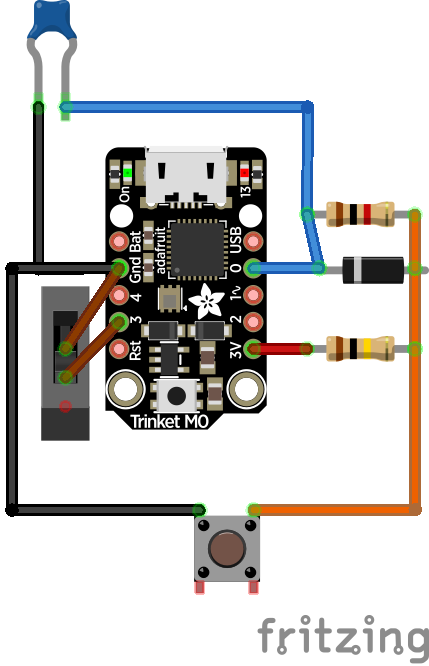
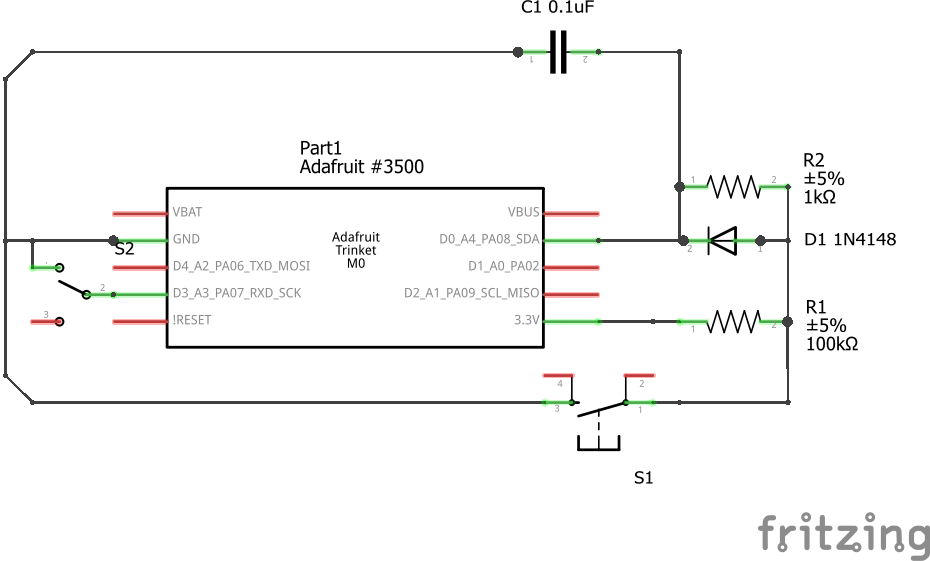

# Submorse Controller
Morse key adapter for use with the Submorse Steam game. Device sends "end character" signal ("e") after a timeout to avoid having to hit separate buttons

Slide switch determines whether the device emulates a keyboard or a mouse:
- Keyboard, for use with Submorse, sends space bar on morse key down, 'e' on character completed.
- Mouse, for use with other morse practice programs, sends left mouse click on morse key down.

If the slide switch is changed, the device must be restarted.

## Hardware:
- Adafruit Trinket m0
- 100k resistor
- 1k resistor
- 0.1uF capacitor
- 1N4148 diode
- Slide switch
- 3.5mm audio jack (to connect morse key, this takes the place of the momentary switch in the images below)

